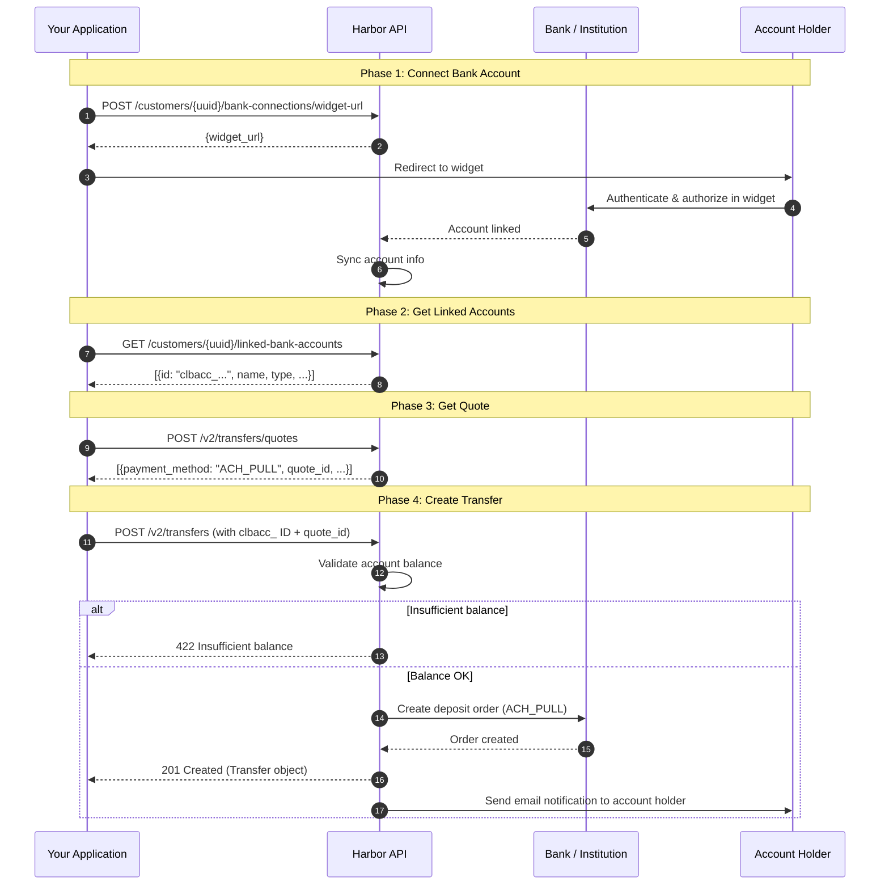

### ACH Pull Integration Guide

This document describes how to integrate the ACH Pull (direct bank account debit) feature via the OwlPay Harbor API, allowing your end users to initiate deposits directly from their linked U.S. bank accounts.

***

<Callout icon="⚠️" theme="warn">
  The ACH Pull feature is currently available only to Applications registered as **US-based companies**. Your business operating location and company registered address must be located in a state where OwlPay holds a Money Transmitter License (MTL).
</Callout>

> 📘 **Authorization Email Required**
>
> Before executing an ACH Pull transaction, OwlPay will send an authorization email to the Customer requesting their approval. The email will clearly identify which Application is initiating the pull request.

***

#### Complete Flow Diagram



***

#### Prerequisites

1. Your Application has the `ACH_PULL` payment method enabled
2. The Customer has completed KYC verification (status: `VERIFIED`)
3. The Customer's sub-account (an FBO bank account for on-ramp) has been provisioned (status: `ONBOARDED`)

#### Flow Overview

```
1. Connect Bank    → User links a bank account via Widget
2. List Accounts   → Retrieve the list of linked bank accounts
3. Get Quote       → Get an ACH_PULL quote
4. Create Transfer → Submit a transfer with the linked account ID
5. Email Notification → OwlPay sends a notification email to the account holder
```

> **Important:** When an ACH Pull transfer is created, OwlPay will send a notification email to the bank account holder informing them of the upcoming debit. Please ensure the user is aware of this process.

***

#### Step 1: Connect Bank Account

First, generate a bank connection Widget URL for the customer and redirect them to complete bank account authorization.

##### Request

```bash
curl --location --request POST 'https://harbor-sandbox.owlpay.com/api/v1/customers/{{CUSTOMER_UUID}}/bank-connections/widget-url' \
--header 'Content-Type: application/json' \
--header 'Accept: application/json' \
--header 'X-API-KEY: {{API_KEY}}' \
--data-raw '{
    "redirect_url": {
        "success": "https://yourapp.com/bank-connected",
        "failed": "https://yourapp.com/bank-failed"
    }
}'
```

| Parameter              | Type   | Required | Description                                                                    |
| ---------------------- | ------ | -------- | ------------------------------------------------------------------------------ |
| `redirect_url.success` | string | No       | Redirect URL after successful connection. Supports web links or app deep links |
| `redirect_url.failed`  | string | No       | Redirect URL on failure. Supports web links or app deep links                  |

##### Response (200)

```json
{
    "data": {
        "widget_url": "https://bank-connection.owlpay.com/connect?token=..."
    }
}
```

##### Integration

Present the returned `widget_url` to the user via redirect or iframe. After the user completes bank login and account authorization in the Widget, the system will automatically sync account information.

###### Sandbox Test Credentials

When testing in the Sandbox environment, search for and select **MX Bank** in the connection widget. Use the following credentials to simulate successful connection scenarios:

**1. Basic Connection**

* **Search Bank Name**: `MX Bank`
* **Username**: `mxuser`
* **Password**: Any value (e.g., `password`)
* **Expected Result**: Successful connection with status **CONNECTED**.

**2. OAuth Connection**

* **Search Bank Name**: `MX Bank (OAuth)`
* **Action**:
  1. Search for "MX Bank (OAuth)" in the widget.
  2. You will be redirected to a simulated authorization page.
  3. Click the **Authorize** button.
* **Expected Result**: Simulated success and redirection back to your application.

***

#### Step 2: List Linked Accounts

After the user completes Widget authorization, call this API to retrieve the list of linked bank accounts.

##### Request

```bash
curl --location --request GET 'https://harbor-sandbox.owlpay.com/api/v1/customers/{{CUSTOMER_UUID}}/linked-bank-accounts' \
--header 'Accept: application/json' \
--header 'X-API-KEY: {{API_KEY}}'
```

##### Response (200)

```json
{
    "data": [
        {
            "id": "clbacc_45b93a4affca4bc2818dc189264b6e07",
            "name": "Checking Account",
            "type": "CHECKING",
            "connection": {
                "institution_name": "Chase Bank",
                "status": "CONNECTED",
                "is_syncing": false,
                "last_synced_at": "2026-03-21T08:30:00Z"
            }
        }
    ]
}
```

| Field                         | Description                                                                                                                  |
| ----------------------------- | ---------------------------------------------------------------------------------------------------------------------------- |
| `id`                          | Unique identifier of the linked account, prefixed with `clbacc_`. **This ID is required in Step 4 when creating a transfer** |
| `name`                        | Account name                                                                                                                 |
| `type`                        | Account type: `CHECKING` or `SAVINGS`                                                                                        |
| `connection.institution_name` | Banking institution name                                                                                                     |
| `connection.status`           | Connection status                                                                                                            |

> To query a single account, use:
> `GET /api/v1/customers/{customer_uuid}/linked-bank-accounts/{linked_bank_account_id}`

***

#### Step 3: Get ACH Pull Quote

Before initiating a transfer, get a quote to confirm the exchange rate, fees, and settlement amount.

##### Request

```bash
curl --location --request POST 'https://harbor-sandbox.owlpay.com/api/v2/transfers/quotes' \
--header 'Content-Type: application/json' \
--header 'Accept: application/json' \
--header 'X-API-KEY: {{API_KEY}}' \
--data-raw '{
    "on_behalf_of": "{{CUSTOMER_UUID}}",
    "source": {
        "amount": "100.00",
        "asset": "USD",
        "type": "individual",
        "country": "US"
    },
    "destination": {
        "asset": "USDC",
        "type": "individual",
        "chain": "stellar"
    }
}'
```

##### Response (200)

The response includes quotes for multiple payment methods. Select the item where `payment_method` is `ACH_PULL`.

```json
[
    {
        "id": "quote_f03AirZ3ZY...KBtFQfZtPDYv",
        "payment_method": "ACH_PULL",
        "source_amount": "100.00",
        "source_currency": "USD",
        "destination_amount": "99.50",
        "destination_currency": "USDC",
        "fee": "0.50",
        "quote_expire_date": "2026-03-21T09:30:00Z"
    }
]
```

> Save the `id` (i.e., `quote_id`) from the `ACH_PULL` quote — it is required in the next step to create the transfer.

***

#### Step 4: Create ACH Pull Transfer

Use the `clbacc_` ID from Step 2 and the `quote_id` from Step 3 to create the transfer.

<Callout icon="⏳" theme="info">
  **Settlement Time Notice:** ACH Pull transfers typically settle in **T+2** business days. For more details on fund availability and payment locks, see [Settlement and Payment Lock Time](settlement-and-payment-lock-time).
</Callout>

##### Request

```bash
curl --location --request POST 'https://harbor-sandbox.owlpay.com/api/v2/transfers' \
--header 'Content-Type: application/json' \
--header 'Accept: application/json' \
--header 'X-API-KEY: {{API_KEY}}' \
--header 'Idempotency-Key: {{Idempotency-Key}}' \
--data-raw '{
    "on_behalf_of": "{{CUSTOMER_UUID}}",
    "quote_id": "{{QUOTE_ID}}",
    "application_transfer_uuid": "{{YOUR_ORDER_ID}}",
    "source": {
        "payment_instrument": {
            "linked_bank_account_id": "clbacc_45b93a4affca4bc2818dc189264b6e07"
        }
    },
    "destination": {
        "beneficiary_info": {
            "...": "Fill according to quote requirements"
        },
        "payout_instrument": {
            "address": "0x1234567890abcdef1234567890abcdef12345678"
        },
        "transfer_purpose": "SALARY",
        "is_self_transfer": true
    }
}'
```

| Parameter                                          | Type   | Required | Description                                                         |
| -------------------------------------------------- | ------ | -------- | ------------------------------------------------------------------- |
| `on_behalf_of`                                     | string | Yes      | Customer UUID                                                       |
| `quote_id`                                         | string | Yes      | Quote ID obtained in Step 3                                         |
| `application_transfer_uuid`                        | string | Yes      | Your order ID (used for idempotency)                                |
| `source.payment_instrument.linked_bank_account_id` | string | Yes      | **Linked account ID from Step 2 (prefixed with `clbacc_`)**         |
| `destination`                                      | object | Yes      | Destination information (payout address, beneficiary details, etc.) |

##### Response (201 Created)

On success, returns the full Transfer object with an initial status of `PENDING_CUSTOMER_TRANSFER_START`.

##### Error Scenarios

| HTTP Status | Reason                                                                 |
| ----------- | ---------------------------------------------------------------------- |
| `422`       | Insufficient account balance to cover the transfer amount              |
| `422`       | Customer has not completed bank compliance onboarding (CRB Onboarding) |
| `422`       | Customer is missing `bank_module_app_customer_id`                      |
| `422`       | The bank account has been blocklisted                                  |
| `404`       | Customer not found or does not belong to this Application              |

***

#### Email Notification

When an ACH Pull transfer is successfully created, **OwlPay will automatically send a notification email to the bank account holder** containing:

* Debit amount and currency
* Transaction details

This email ensures the account holder is aware of the upcoming ACH debit, in compliance with regulatory requirements. No additional action is needed from the Application side for this notification.

***

#### Transfer Status Flow

| Status                            | Description                                                 |
| --------------------------------- | ----------------------------------------------------------- |
| `PENDING_CUSTOMER_TRANSFER_START` | Transfer created, awaiting ACH processing                   |
| `PENDING_HARBOR`                  | Being processed by the bank                                 |
| `COMPLETED`                       | Transfer complete, funds settled                            |
| `REJECT`                          | Transfer rejected                                           |
| `ON_HOLD`                         | Transfer temporarily frozen (may require additional review) |

> We recommend listening for transfer status changes via Webhooks to keep your system updated in real time.
