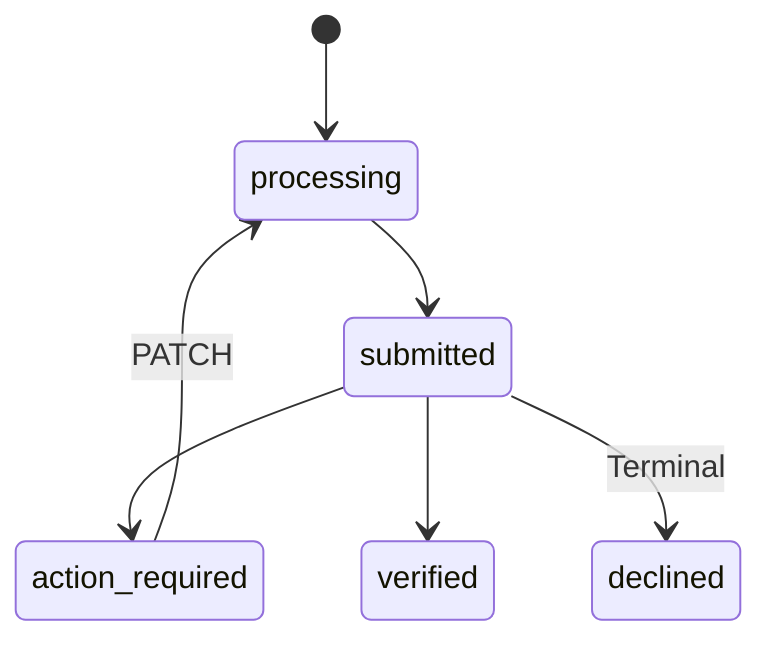

**Customer Onboarding · API v1 & v2**

This guide provides a detailed operational workflow for handling situations when a customer's onboarding status requires correction (**`action_required`**), is permanently rejected (**`declined`**), or is flagged for additional compliance clarifications (**Request for Information / RFI**). 

By implementing these programmatic workflows, you can build a seamless, self-correcting onboarding experience directly within your own user interface.

> ⚡ Quick Links: Guide Shortcuts
> 
> Select a shortcut below to jump directly to the detailed workflow payload examples and implementation steps:

<Cards columns={2}>
  <Card title="Action Required Status" href="#1-action-required-status-action_required" icon="fa-solid fa-triangle-exclamation">
    Jump directly to the Action Required section to learn how to detect and PATCH corrected onboarding data.
  </Card>
  <Card title="Requests for Information (RFI)" href="#3-customer-requests-for-information-rfi" icon="fa-solid fa-file-invoice">
    Jump directly to the Customer Requests for Information (RFI) section to explore Hosted Page and Direct API answer flows.
  </Card>
</Cards>

***

### 1. Action Required Status (`action_required`)

During the manual or automated review process, if submitted onboarding data is found to be incomplete, incorrect, or unreadable, the onboarding status transitions to `action_required`.

#### 1.1 Detecting Actions Required

When a customer's onboarding status becomes `action_required`, you can retrieve details of the outstanding requirements using the following polling request:

> `GET /api/v1/customers/{customer_uuid}/onboarding` (v1)
> 
> `GET /api/v2/customers/{customer_uuid}/individual/onboarding` (v2)

Response Body Example (`200 OK`):

```json
{
  "data": {
    "id": "onb_1234567890",
    "customer_id": "cus_1234567890",
    "applicant": "company",
    "status": "action_required",
    "pending_requirements": [
      { 
        "resultCode": 109, 
        "description": "Proof of business operating address is required." 
      }
    ],
    "submitted_at": null,
    "created_at": "2026-06-12T06:35:50.000000Z",
    "updated_at": "2026-06-12T07:02:11.000000Z"
  }
}
```

The key fields for debugging are:
*   **`pending_requirements[]`**: An array of specific issues reported by the review process. Each item contains a numeric `resultCode` and a human-readable `description` explaining what is missing or invalid.
*   **Systemic / Document Processing Errors**: If the compliance provider rejected the submission due to a system error or processing timeout rather than a user data issue, the array will contain a `provider_error` block:
    ```json
    {
      "source": "provider_error",
      "description": "<merchant-safe error message>"
    }
    ```

#### 1.2 Resolving Action Required (PATCH)

To resolve the outstanding issues, collect the corrected values from your user and submit them as a complete payload using a **PATCH** request:

> `PATCH /api/v1/customers/{customer_uuid}/onboarding` (v1)
> 
> `PATCH /api/v2/customers/{customer_uuid}/individual/onboarding` (v2)

For business onboarding (v1), the payload must re-submit `company`, `associated_persons`, and `company_files`. For individual onboarding (v2), submit the updated `individual` data. 

> ⚠️ Important Integration Rule for PATCH
> 
> The `PATCH` payload completely replaces the stored onboarding data. You **must resend all required fields**, not just the fields being modified. 

Once the PATCH request is successfully received, the onboarding status will transition from `action_required` back to `processing` for re-evaluation.

#### 1.3 Handling Action Required Customer Status

If a customer's primary status is marked as `action_required` (for example, in a `GET /customers/{customer_uuid}` call), the onboarding process can still be restarted or updated. 

You can retrieve the human-readable explanation of why correction is needed from the `review_reason` field of the customer object:

```json
{
  "data": {
    "id": "cus_1234567890",
    "status": "action_required",
    "review_reason": "Please provide a clearer photo of the address proof; the uploaded document is blurred."
  }
}
```

Use `review_reason` to inform your customer of the exact issue, then prompt them to submit a fresh `PATCH` payload to resume processing.

***

### 2. Declined Customer Status (`declined`)

A declined status indicates a final, terminal decision by the compliance team. 

#### 2.1 Onboarding Exceptions & Declined Status

*   **Action Required (`action_required`):** Temporary or correctable. The customer can submit corrected documents or updated details via a `PATCH` request.
*   **Declined (`declined`):** Terminal decision. No further documents or resubmissions are allowed on this customer record.
*   **Banned:** Absolute terminal block due to legal, regulatory, or sanction requirements.



#### 2.2 Programmatic Restrictions on Declined Customers

Once a customer is marked as `declined`, the record is locked:
*   Any attempt to call `PATCH` or `POST` onboarding for a declined customer returns a **409 Conflict** error.
*   The error response body includes the specific error identifier: **`declined_is_final`**.
*   To proceed, you must create a new customer record with a fresh UUID.

***

### 3. Customer Requests for Information (RFI)

During active onboarding reviews, compliance may request additional supporting evidence or custom clarifications without requiring edits to the main onboarding payload. This is handled via a **Request for Information (RFI)**.

When an RFI is raised, the customer record is updated with:
*   `Customer.is_rfi_required` set to `true`.
*   A unique secure URL returned in the `rfi_link` field.

You can resolve the outstanding RFI using one of two integration approaches:

#### Option A: Hosted Page (Zero-Code)

If you prefer a low-overhead, zero-code integration:
1.  Poll the customer object and retrieve the secure `rfi_link` URL.
2.  Redirect your customer to the `rfi_link` in their browser or display it inside an iframe.
3.  The customer will view the requested questions and upload documents on Harbor's secure hosted page.
4.  Once submitted by the customer, Harbor's compliance team receives the answers, and no further action is required from your backend.

#### Option B: Direct API (API-Driven)

If you prefer to maintain 100% control over the user experience and display the RFI form within your own custom UI, use our direct RFI API:

##### 1. Retrieve RFI Questions

Fetch the pending compliance questions for the customer:

> `GET /api/v1/customers/{customer_uuid}/rfi`
> 
> *Scope required: `CUSTOMER_RFI_R`*

Example Response (`200 OK`):
```json
{
  "data": {
    "type": "general",
    "status": "pending",
    "description": "Please provide additional documents.",
    "questions": [
      { 
        "key": "1", 
        "label": "Proof of address", 
        "type": "short_answer", 
        "required": true 
      }
    ],
    "answers": null
  }
}
```

##### 2. Submit RFI Answers

Collect the answers in your application's UI, and submit them back to Harbor:

> `POST /api/v1/customers/{customer_uuid}/rfi/answer`
> 
> *Scope required: `CUSTOMER_RFI_A`*

Example Request Payload:
```json
{
  "answers": {
    "1": "123 Main St, Taipei..."
  }
}
```

Once submitted, the RFI status transitions to `answered` and `is_rfi_required` will automatically return to `false` (after compliance reviews and resolves the submission), resuming the standard onboarding state machine.

> 🚨 RFI State Constraints
> 
> Attempting to submit answers to an RFI that has already been resolved or answered will return a **409 Conflict** error.

***

### 4. Onboarding & RFI Webhooks

To avoid polling, subscribe to the following webhook events to receive real-time status updates:

*   **`customer_onboarding.action_required`**: Sent when the onboarding status transitions to `action_required`.
*   **`customer_onboarding.submitted`**: Sent when onboarding data is successfully received and queued for review.
*   **`customer_onboarding.verified`**: Sent when onboarding review succeeds and the customer is approved.
*   **`customer_onboarding.declined`**: Sent when a customer is permanently declined.
*   **`customer.rfi.raised`**: Fired when an RFI is raised and the `rfi_link` becomes active.
*   **`customer.rfi.resolved`**: Fired when an RFI has been successfully answered and resolved.
