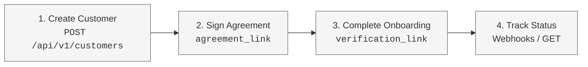

The **Hosted Link Onboarding** is a low-code/no-code onboarding option. Instead of building complex forms to collect customer information and writing code to upload large documents, you can redirect your users directly to Harbor's secure, hosted onboarding pages (`gokyb`/`gokyc`).

Harbor hosts the entire user journey: collecting company/individual details, prompting for required file uploads, executing live biometric and identity document scanning (using the camera), and managing electronic agreement signatures.

---

### The Hosted Link Workflow



#### Step 1: Create a Customer

First, create a customer record in Harbor via the `POST /api/v1/customers` endpoint. You must specify the customer's `type` as either `business` or `individual`.

```sh
curl -X POST "https://harbor-sandbox.owlpay.com/api/v1/customers" \
 -H "X-API-KEY: {{API_KEY}}" \
 -H "Content-Type: application/json" \
 -d '{
   "type": "business",
   "company_name": "Acme US Inc",
   "email": "ops@acme.us"
 }'
```

The response includes an `agreement_link` and a `verification_link` (for businesses) or `kyc_link` (for individuals):

```json
{
  "data": {
    "uuid": "cus_1234567890",
    "status": "deactivated",
    "type": "business",
    "company_name": "Acme US Inc",
    "email": "ops@acme.us",
    "has_signed_agreement": false,
    "agreement_link": "https://harbor-sandbox.owlpay.com/agreements?uuid=agt_tPo5iKKX...&redirect_url=https%3A%2F%2Fyourdomain.com",
    "verification_link": "https://harbor-sandbox.owlpay.com/gokyb?expires=1749801448&hash=e1e8c...",
    "created_at": "2026-06-13T09:00:00+00:00",
    "updated_at": "2026-06-13T09:00:00+00:00"
  }
}
```

#### Step 2: Sign the Harbor Agreement (If Required)

Before verification can proceed, the customer must sign the Harbor service agreement.
1. Extract the `agreement_link` from the customer payload.
2. Redirect your user to the `agreement_link` in their web browser.
3. Once the user signs the document electronically, they are redirected back to your configured `redirect_url`.

#### Step 3: Redirect to the Onboarding Interface

Redirect the user to the `verification_link` extracted in Step 1. Harbor will present a tailored flow depending on whether the customer is a Business or an Individual:

##### 🏢 Business (KYB) Flow (`/gokyb`)
The user is guided through:
- Entering detailed company information (industry, registration number, address, and phone).
- Providing details on the company's Ultimate Beneficial Owners (UBOs), applicants, and representatives.
- Uploading the **6 mandatory corporate files** (such as registration documents, certificate of incumbency, and organization chart).
- Completing real-time biometric face scans and identity document verification for the authorized representative(s).

##### 👤 Individual (KYC) Flow (`/gokyc`)
The user is guided through:
- Confirming nationality, date of birth, and tax jurisdiction.
- Submitting occupation, source of wealth, and purpose of use.
- Launching the device's camera to complete a secure real-time face scan (biometric check) and capturing images of their physical ID card, passport, or driver's license.

---

### Benefits of Hosted Link Onboarding

> 📘 Secure & Compliant
> - **Zero Document Storage Liability**: You never collect or store sensitive files (like corporate certificates, bank statements, or national IDs). They go directly to Harbor's encrypted data stores.
> - **Biometric Integration Out-of-the-Box**: Biometric face checks require complex camera controls. Our hosted page manages this securely across iOS, Android, and desktop browsers.
> - **Automatic Validation Updates**: If Harbor updates the list of required documents for a certain country, the hosted form automatically updates. You don't have to change any code.
> - **Lower API Footprint**: You only make 1 API call (`POST /customers`) to initiate the entire onboarding journey.

---

### Step 4: Track Progress

Once the user completes the hosted flow, the onboarding status becomes `submitted` and then transitions to either `verified` or `rejected` / `action_required`.

- Track this using Webhooks or GET polling.
- See the [Customer Onboarding Overview](/docs/onboarding-overview) page for details on status tracking, statuses, and webhook formats.
