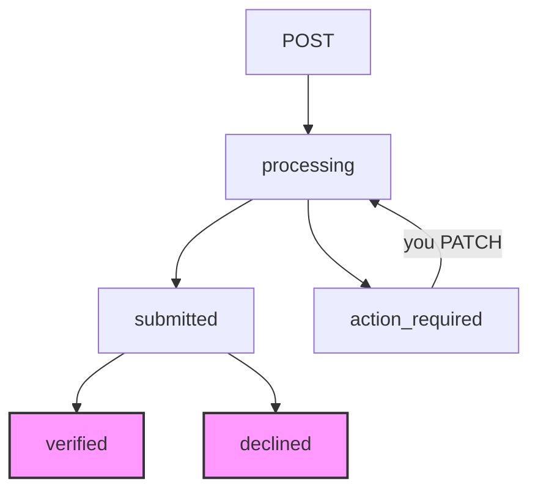

This guide introduces the direct API onboarding integration. Collect your customers' profiles and documents directly in your application and submit them to Harbor — either as a complete, single-call payload, or incrementally through a progressive level-based flow.

Based on the customer's type and your preferred integration path, select the appropriate guide below:

<Cards>
  <Card title="Onboard Business (KYB) via API" href="/docs/onboard-business" icon="fa-briefcase">
    **Business Onboarding**: Learn how to submit company profiles, associated persons (directors, UBOs, representatives), and corporate registration documents in one single API request.
  </Card>
  <Card title="Onboard Individual (KYC) via API" href="/docs/onboard-individual" icon="fa-user">
    **Standard Individual Onboarding (v1)**: Learn how to submit full personal details, residential address, and identity documents in a single, all-or-nothing call.
  </Card>
  <Card title="Customer Tiers (Graded Onboarding)" href="/docs/graded-onboarding" icon="fa-solid fa-layer-group">
    **Graded Individual Onboarding (v2)**: Onboard individual customers incrementally using progressive tiers (Level 1, 2, or 3) and dynamic limits to minimize onboarding friction.
  </Card>
</Cards>

---

### 1. Shared Infrastructure & Common Parts

Regardless of whether you are onboarding a business or an individual, the core infrastructure, endpoints, lifecycle, headers, and error handling remain identical.

#### 1.1 Environments & Base URLs

| Environment | Base URL |
|---|---|
| Sandbox | `https://harbor-sandbox.owlpay.com` |
| Production | `https://harbor.owlpay.com` |

The endpoints use standard authentication with your application's API key.

#### 1.2 Authentication & Headers

| Header | Required | Notes |
|---|---|---|
| `X-API-KEY` | Yes | Your application API key. |
| `Content-Type` | Yes | Must be `application/json`. |
| `Accept` | Yes | Must be `application/json`. |
| `Idempotency-Key` | Yes for `POST`/`PATCH` | A unique value per logical request. Replays with the same key within 24h are de-duplicated and return `409 idempotency_conflict`, making retries safe. |

#### 1.3 Core Endpoints

| Method | Path | Purpose |
|---|---|---|
| `POST` | `/api/v1/customers/{{customer_uuid}}/onboarding` | Submit onboarding data. Returns **202 Accepted**. |
| `GET` | `/api/v1/customers/{{customer_uuid}}/onboarding` | Fetch latest onboarding status. |
| `PATCH` | `/api/v1/customers/{{customer_uuid}}/onboarding` | Modify/correct submitted sections during `action_required`. |

---

### 2. Meta APIs (Reference-Data Lookups)

Dynamic lookup endpoints must be called in real-time to display correct dropdown values in your user interface. Some are shared, while others are specific to the onboarding type:

#### 2.1 Shared Meta APIs
* **Address Subdivisions (`state`)**:
  `GET /api/v1/countries/{country}/subdivisions`
  Used to obtain ISO 3166-2 state/subdivision codes (e.g. `VA` for Virginia, `ENG` for England). Submit the subdivision `code` in address payloads. Omit `state` for countries with no subdivisions.

#### 2.2 Business-Specific (KYB) Meta APIs
* **Job Titles / Positions**:
  `GET /api/v1/job-titles`
  Returns allowed roles for directors, UBOs, and representatives (`associated_persons[].position`).
* **Industry Classifications**:
  `GET /api/v1/countries/{country}/industries`
  Returns allowed industry slugs for the company's country of incorporation (`company.industry`).

#### 2.3 Individual-Specific (KYC) Meta APIs
* **Occupations**:
  `GET /api/v1/occupations`
  Returns allowed occupation values for individuals (`individual.occupation`).

---

### 3. Onboarding Status & Lifecycle

Every onboarding process proceeds through the same state machine:

| Status | Meaning | Developer Action |
|---|---|---|
| `processing` | Harbor is validating and forwarding the submission. | Wait. |
| `action_required` | The submission has errors or outstanding requirements. | Read `pending_requirements` and update via `PATCH`. |
| `submitted` | Sent to the compliance provider; awaiting checks. | Wait. |
| `verified` | Verification passed successfully. | **Done.** Customer is cleared to transact. |
| `declined` | The onboarding submission was permanently rejected (terminal). | Cannot be corrected. Create a new customer record. |

> 📘 Onboarding Lifecycle & Exceptions Playbook
> 
> For a highly detailed guide on how to programmatically detect and resolve `action_required` states, handle final `declined` conditions, or manage customer-level Requests for Information (RFIs), please refer directly to the **[Onboarding & RFI Guide](doc:onboarding-rfi)**.

---

### 4. Tracking Progress

#### Option A — Status Polling (GET)

Call `GET /api/v1/customers/{{customer_uuid}}/onboarding` periodically. When the status is `action_required`, inspect the `pending_requirements` array.

#### Option B — Webhooks (Recommended)

Subscribe to the following webhook events to receive real-time updates:

* `customer_onboarding.submitted` — accepted for verification
* `customer_onboarding.action_required` — requires data correction
* `customer_onboarding.verified` — verification passed
* `customer_onboarding.declined` — verification failed (terminal)

---

### 5. Size Limits

To prevent upload timeouts, adhere strictly to the following size limits across all files (passports, corporate certificates, proof of address, etc.):

* **Per File:** ≤ 8 MB (after base64 decoding).
* **Whole Request:** ≤ 50 MB (total decoded size of all files in the request body).

---

### 6. Global Error Code Reference

When validation or business rules are violated, Harbor returns standard validation error arrays (`422`), state conflicts (`409`), or explicit custom numeric error codes.

> 📘 Consolidated Error Code Reference
> 
> For a comprehensive table of all onboarding, validation, upgrade conflict, and gateway middleware error codes, please refer directly to the **[Error Codes](doc:error-codes)** guide.
