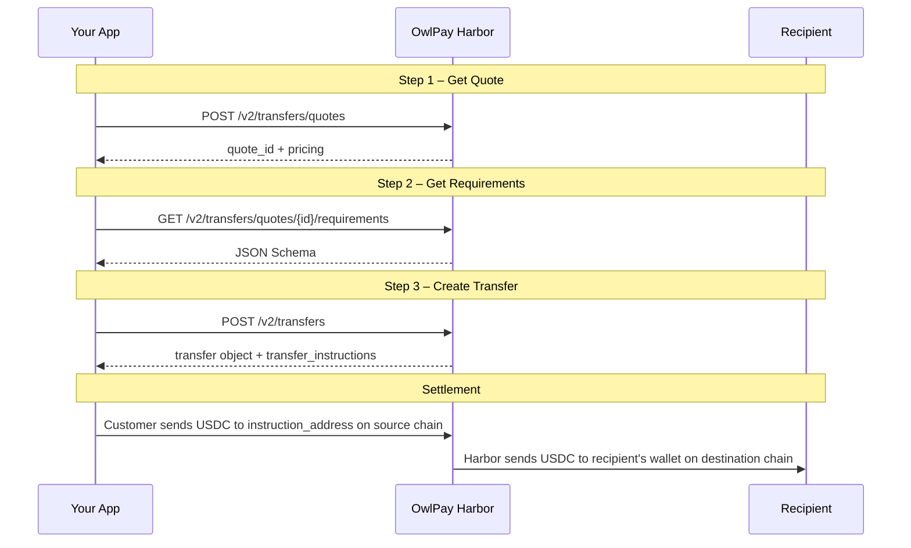

Transfer stablecoin (e.g., USDC) from one blockchain to another (e.g., Ethereum → Avalanche) and deliver it to a recipient's wallet on the destination chain.

### Transfer Flow Overview

The on-chain transfer follows a three-step process: get a quote, retrieve the transfer requirements, then create the transfer.



| Step | API Endpoint | Purpose |
|------|-------------|---------|
| 1 | `POST /v2/transfers/quotes` | Get exchange rate, fees, and a `quote_id` |
| 2 | `GET /v2/transfers/quotes/{quote_id}/requirements` | Get the JSON Schema defining required fields for the transfer |
| 3 | `POST /v2/transfers` | Create the transfer using the `quote_id` and validated payload |

---

### Step 1: Get Quote

#### Request Example

```curl
curl --location 'https://harbor-sandbox.owlpay.com/api/v2/transfers/quotes' \
--header 'Accept: application/json' \
--header 'Content-Type: application/json' \
--header 'X-API-KEY: ••••••' \
--data '{
    "source": {
        "country": "US",
        "chain": "ethereum",
        "asset": "USDC",
        "type": "individual"
    },
    "destination": {
        "chain": "avalanche",
        "asset": "USDC",
        "amount": 3000,
        "type": "individual"
    },
    "commission": {
        "amount": 10,
        "percentage": 0
    }
}'
```

#### Response Example

```json
{
    "data": [
        {
            "id": "quote_BoWt0rEkZgjEFkAKJSVAqyZqZxfy3gllaipYhJHH",
            "payment_method": "ON_CHAIN",
            "chain": "ethereum",
            "source_country": null,
            "destination_country": null,
            "source_amount": "3010.000000",
            "source_currency": "USDC",
            "destination_amount": "3000.000000",
            "destination_currency": "USDC",
            "destination_chain": "avalanche",
            "exchange_rate": "1.000000",
            "exchange_pair": "USDC/USDC",
            "crypto_settlement_time_min": 5,
            "crypto_settlement_time_max": 20,
            "crypto_settlement_time_unit": "MINUTES",
            "source_type": "individual",
            "destination_type": "individual",
            "quote_expire_date": "2025-12-26T18:38:42+00:00",
            "crypto_funds_settlement_expire_date": "2025-12-26T18:38:42+00:00",
            "fees": [
                {
                    "type": "HARBOR_FEE",
                    "amount": "55.160875",
                    "currency": "USDC",
                    "charge_from": "OwlPay Harbor",
                    "payer": "Wallet Service Provider"
                },
                {
                    "type": "COMMISSION_FEE",
                    "amount": "10.000000",
                    "currency": "USDC",
                    "charge_from": "Wallet Service Provider",
                    "payer": "customer"
                }
            ],
            "created_at": "2025-12-26T17:08:42+00:00",
            "updated_at": "2025-12-26T17:08:42+00:00"
        }
    ]
}
```

<br />

### Step 2: Get Requirements by quote_id

#### Request Example

```curl
curl --location 'https://harbor-sandbox.owlpay.com/api/v2/transfers/quotes/{{quote_id}}/requirements' \
--header 'Accept: application/json' \
--header 'Content-Type: application/json' \
--header 'X-API-KEY: ••••••'
```

<br />

#### Response Example

```json
{
    "$schema": "https://json-schema.org/draft/2020-12/schema",
    "type": "object",
    "additionalProperties": false,
    "required": [
        "quote_id",
        "source",
        "destination",
        "on_behalf_of",
        "application_transfer_uuid"
    ],
    "properties": {
        "on_behalf_of": {
            "type": "string"
        },
        "quote_id": {
            "type": "string"
        },
        "application_transfer_uuid": {
            "type": "string"
        },
        "source": {
            "type": "object",
            "additionalProperties": false,
            "required": [
                "payment_instrument"
            ],
            "properties": {
                "payment_instrument": {
                    "type": "object",
                    "additionalProperties": false,
                    "properties": {
                        "address": {
                            "type": "string"
                        }
                    },
                    "required": [
                        "address"
                    ]
                }
            }
        },
        "destination": {
            "type": "object",
            "additionalProperties": false,
            "required": [
                "beneficiary_info",
                "payout_instrument",
                "transfer_purpose",
                "is_self_transfer",
                "beneficiary_receiving_wallet_type",
                "beneficiary_institution_name"
            ],
            "properties": {
                "beneficiary_info": {
                    "type": "object",
                    "additionalProperties": false,
                    "properties": {
                        "beneficiary_name": {
                            "type": "string",
                            "title": "Recipient Full Name",
                            "maxLength": 140
                        },
                        "beneficiary_address": {
                            "type": "object",
                            "additionalProperties": false,
                            "properties": {
                                "street": {
                                    "type": "string",
                                    "maxLength": 200
                                },
                                "city": {
                                    "type": "string",
                                    "maxLength": 80
                                },
                                "state_province": {
                                    "type": "string",
                                    "maxLength": 80
                                },
                                "postal_code": {
                                    "type": "string",
                                    "maxLength": 20
                                },
                                "country": {
                                    "type": "string",
                                    "minLength": 2,
                                    "maxLength": 2
                                }
                            },
                            "required": [
                                "street",
                                "city",
                                "country"
                            ]
                        },
                        "beneficiary_dob": {
                            "type": "string",
                            "title": "Recipient Date of Birth"
                        },
                        "beneficiary_id_doc_number": {
                            "type": "string",
                            "title": "Recipient ID Number",
                            "maxLength": 80
                        }
                    },
                    "required": [
                        "beneficiary_dob",
                        "beneficiary_name",
                        "beneficiary_id_doc_number",
                        "beneficiary_address"
                    ]
                },
                "payout_instrument": {
                    "type": "object",
                    "additionalProperties": false,
                    "properties": {
                        "address": {
                            "type": "string",
                            "title": "Blockchain Address"
                        },
                        "address_memo": {
                            "type": "string",
                            "title": "Blockchain Address Memo"
                        }
                    },
                    "required": [
                        "address"
                    ]
                },
                "transfer_purpose": {
                    "type": "string",
                    "enum": [
                        "TRANSFER_TO_OWN_ACCOUNT",
                        "FAMILY_MAINTENANCE",
                        "EDUCATION",
                        "MEDICAL_TREATMENT",
                        "HOTEL",
                        "TRAVEL",
                        "REPAYMENT_OF_LOANS",
                        "TAX_PAYMENT",
                        "PURCHASE_PROPERTY",
                        "PROPERTY_RENTAL",
                        "INSURANCE_PREMIUM",
                        "PRODUCT_INDEMNITY_INSURANCE",
                        "INSURANCE_CLAIMS",
                        "MUTUAL_FUND_INVESTMENT",
                        "INVESTMENT_SHARES",
                        "DONATIONS",
                        "SALARY",
                        "INFO_SERVICE",
                        "ADVERTISING",
                        "ROYALTY_FEES",
                        "BROKER_FEES",
                        "ADVISOR_FEES",
                        "REPRESENTATIVE_EXPENSES",
                        "CONSTRUCTION",
                        "TRANSPORTATION",
                        "EXPORTED_GOODS",
                        "DELIVERY_FEES",
                        "GENERAL_GOODS_OFFLINE"
                    ]
                },
                "is_self_transfer": {
                    "type": "boolean"
                },
                "beneficiary_receiving_wallet_type": {
                    "type": "string"
                },
                "beneficiary_institution_name": {
                    "type": "string"
                }
            }
        }
    },
    "title": "BLOCKCHAIN_BLOCKCHAIN",
    "$comment": "{\"bank_title\":\"BLOCKCHAIN_BLOCKCHAIN\",\"mapping_version\":1}"
}
```

<br />

### Step 3: Create Transfer

#### Request Example

```curl
curl --location 'https://harbor-sandbox.owlpay.com/api/v2/transfers' \
--header 'Content-Type: application/json' \
--header 'Accept: application/json' \
--header 'X-API-KEY: ••••••' \
--data '{
    "on_behalf_of": "{{YOUR_CUSTOMER_UUID}}",
    "quote_id": "{{QUOTE_UUID}}",
    "application_transfer_uuid": "{{YOUR_APPLICATION_TRANSFER_UUID}}",
    "source": {
        "payment_instrument": {
            "address": "0x4B20993Bc481177ec7E8f571ceCaE8A9e22C02db"
        }
    },
    "destination": {
        "beneficiary_info": {
            "beneficiary_dob": "1990-01-01",
            "beneficiary_id_doc_number": "12345678",
            "beneficiary_address": {
                "street": "xxx 1234th Ave S",
                "city": "Minneapolis",
                "state_province": "MN",
                "postal_code": "55416",
                "country": "US"
            },
            "beneficiary_name": "John Doe"
        },
        "payout_instrument": {
            "address": "0x4B20993Bc481177ec7E8f571ceCaE8A9e22C02db"
        },
        "transfer_purpose": "SALARY",
        "is_self_transfer": true,
        "beneficiary_receiving_wallet_type": "personalWallet",
        "beneficiary_institution_name": "MetaMask"
    }
}'
```

#### Response Example

```json
{
    "data": {
        "uuid": "transfer_A1NRYAofXd18qNz5buxLzb8mMhk2oxKhms0aszUR",
        "object": "transfer",
        "status": "pending_customer_transfer_start",
        "type": "swap",
        "settlement_strategy": "immediate",
        "source_received": false,
        "on_behalf_of": "cus_9QMwIz1aLtIM9zzFUeqnqrl2mZRkjzmWeaszNbiS",
        "source": {
            "chain": "ethereum",
            "payment_instrument": {
                "chain": "ethereum",
                "address": "0x4B20993Bc481177ec7E8f571ceCaE8A9e22C02db"
            },
            "asset": "USDC",
            "amount": "3010.00000000"
        },
        "destination": {
            "asset": "USDC",
            "amount": "3000.00000000",
            "chain": "avalanche",
            "payout_instrument": {
                "chain": "avalanche",
                "address": "0x4B20993Bc481177ec7E8f571ceCaE8A9e22C02db",
                "address_memo": null
            },
            "is_self_transfer": false,
            "transfer_purpose": "SALARY",
            "beneficiary_receiving_wallet_type": null,
            "beneficiary_institution_name": null
        },
        "application_transfer_uuid": "OWLTING_HARBOR_OFF_RAMP_002052",
        "transfer_instructions": {
            "instruction_chain": "ethereum",
            "instruction_address": "0xada6502666aee6e78f2addad387f46674d0d626f",
            "instruction_memo": null
        },
        "commission": {
            "percentage": "0",
            "amount": "10"
        },
        "fees": [
            {
                "type": "HARBOR_FEE",
                "amount": "55.160875",
                "currency": "USDC",
                "charge_from": "OwlPay Harbor",
                "payer": "Wallet Service Provider"
            },
            {
                "type": "COMMISSION_FEE",
                "amount": "10.000000",
                "currency": "USDC",
                "charge_from": "Wallet Service Provider",
                "payer": "customer"
            }
        ],
        "receipt": {
            "initial_asset": "USDC",
            "initial_amount": "3010.00000000",
            "commission_fee": "10.000000",
            "harbor_fee": "55.160875",
            "final_asset": "USDC",
            "final_amount": "3000.00000000",
            "exchange_rate": "1.00000000",
            "transaction_hash": null
        },
        "meta_data": null,
        "created_at": "2025-12-26T17:09:37+00:00",
        "updated_at": "2025-12-26T17:09:38+00:00"
    }
}
```
