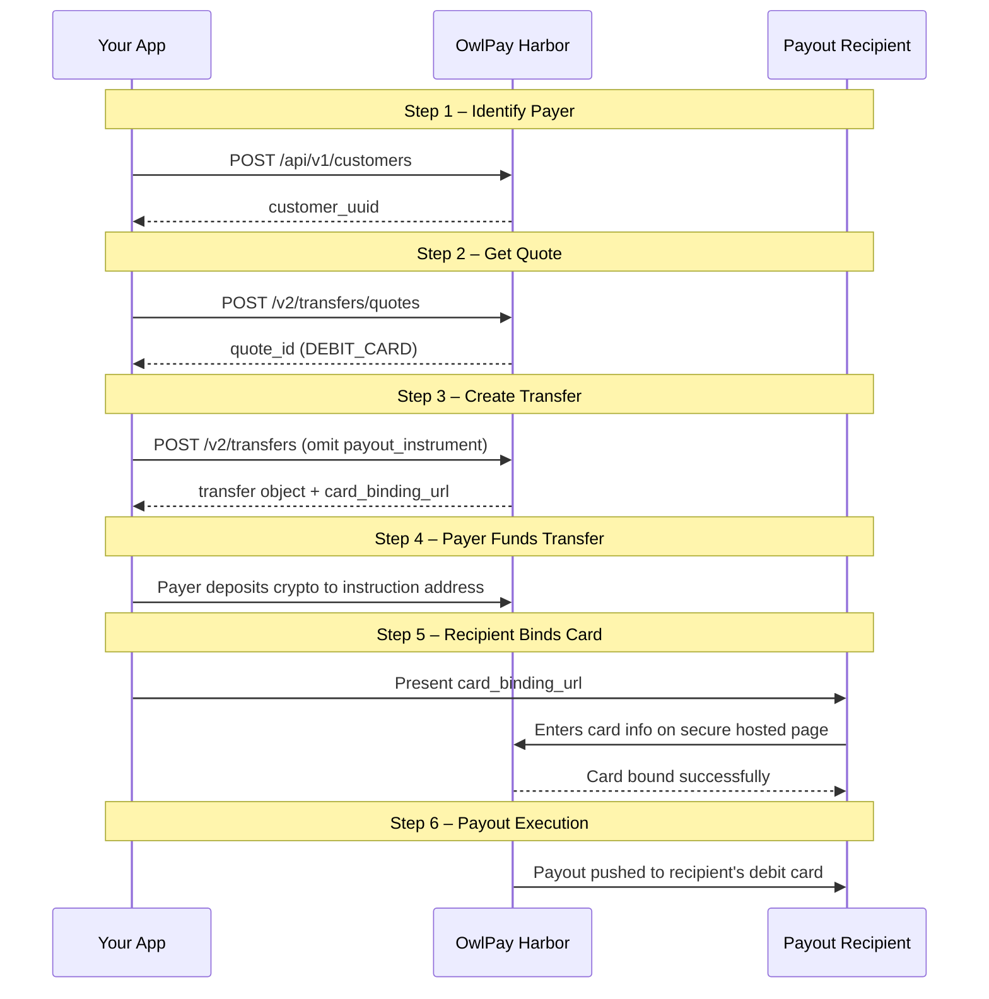

In standard Debit Card off-ramp (payout) transactions, you must collect the recipient's card details up front and provide them via `destination.payout_instrument.linked_card_id`. 

However, OwlPay Harbor also supports **Deferred Card Binding** (commonly known as **"Pay First, Bind Later"**). This flow allows you to initiate an off-ramp transfer without collecting or knowing the recipient's card details in advance. Once the transfer is created and funded, OwlPay Harbor generates a secure, hosted `card_binding_url` where the recipient can enter their card details safely.

---

### User Story

Imagine you want to send USDC, but your recipient wants to receive USD directly on their debit card. 

With "Pay First, Bind Later," you can make the USDC payment first, and then send a secure link to the recipient. As soon as they enter their card details on that page, the USDC is converted to USD and deposited onto their card automatically. It makes the entire transfer experience incredibly smooth and hassle-free.

---

### Transfer Flow Overview

The two sides of the transfer are fully independent and can complete in **either order**:
1. The payer sends USDC to a deposit address Harbor generates.
2. The recipient opens a link and links the debit card that will receive the payout.

The payout only fires once **both** are done.



#### Prerequisites
* An application API key (`X-API-KEY` header on every request).
* Your Harbor application must be configured for US-USD off-ramp with the `DEBIT_CARD` payment method enabled.

---

### 1. Step 1 — Identify the payer (Customer API)

Before initiating a transfer, the payer must be registered as a Customer in Harbor.

#### Endpoints
* `GET /api/v1/customers` — List existing customers.
* `POST /api/v1/customers` — Create a new customer.

---

### 2. Step 2 — Get a quote (Transfer Quote (V2)

Request a quote for the currency corridor using the Customer UUID.

#### Request Endpoint
`POST /api/v2/transfers/quotes`

#### Request Example
```json
{
  "source": {
    "asset": "USDC",
    "chain": "polygon",
    "amount": "250.00",
    "type": "individual",
    "country": "US"
  },
  "destination": {
    "asset": "USD",
    "country": "US",
    "type": "individual"
  },
  "on_behalf_of": "cus_ZMA2YTT6yUUzu1M7sbvjI73EgdDJ0SiUs4T29ZWw"
}
```

#### Response Example
The response contains an array of available quotes—one per supported payment method (WIRE, ACH, DEBIT_CARD, etc.). **Filter this array to find the item where `payment_method === "DEBIT_CARD"`.**

```json
{
  "id": "quote_8WcaT5gB6J0iFzL4Gnb4qfPR4J3SxsAYRfkAIHFh",
  "payment_method": "DEBIT_CARD",
  "chain": "polygon",
  "source_amount": "250.000000",
  "source_currency": "USDC",
  "destination_amount": "249.75",
  "destination_currency": "USD",
  "exchange_rate": "0.99900000",
  "quote_expire_date": "2026-08-17T16:56:07+00:00",
  "crypto_funds_settlement_expire_date": "2026-08-17T16:26:07+00:00",
  "fees": [
    {
      "type": "HARBOR_FEE",
      "amount": "3.500000",
      "currency": "USDC"
    },
    {
      "type": "COMMISSION_FEE",
      "amount": "0.000000",
      "currency": "USDC"
    }
  ],
  "customer_limits": {
    "per_transaction_limit": "3000.00",
    "daily_remaining": "9999.00"
  }
}
```

---

### 3. Step 2b — Fetch the exact requirements schema

To integrate dynamically, we recommend retrieving the JSON Schema representing the required transfer fields.

#### Request Endpoint
`GET /api/v2/transfers/quotes/{quote_id}/requirements`

This endpoint returns a dynamic **JSON Schema (draft 2020-12)** indicating exactly what the transfer creation payload must contain for this specific quote. Required fields, string lengths, enums, and conditionals (such as country-specific state codes) are all declared here.

---

### 4. Step 3 — Create the transfer (the deferred-binding trigger)

To trigger the **deferred card binding** flow, construct the request payload by omitting `destination.payout_instrument` entirely from the request body. If you supply `destination.payout_instrument.linked_card_id` instead, the transfer will process immediately using that card.

#### Request Endpoint
`POST /api/v2/transfers`

#### Request Example
```json
{
  "on_behalf_of": "cus_ZMA2YTT6yUUzu1M7sbvjI73EgdDJ0SiUs4T29ZWw",
  "quote_id": "quote_8WcaT5gB6J0iFzL4Gnb4qfPR4J3SxsAYRfkAIHFh",
  "application_transfer_uuid": "merchant-order-0001",
  "source": {
    "payment_instrument": {
      "address": "0x2a197e6dfbd234d1272b0699310fbc53c3056aea"
    }
  },
  "destination": {
    "beneficiary_info": {
      "beneficiary_name": "Jane Doe",
      "beneficiary_dob": "1990-01-01",
      "beneficiary_id_doc_number": "A1234567",
      "beneficiary_address": {
        "street": "123 Main St",
        "city": "Los Angeles",
        "state_province": "CA",
        "postal_code": "90001",
        "country": "US"
      }
    },
    "transfer_purpose": "TRANSFER_TO_OWN_ACCOUNT",
    "is_self_transfer": true
  }
}
```

---

### 5. Step 4 — Handle the response

On success, a Transfer object is returned, exposing the generated deposit instructions and the card binding URL.

#### Response Example
```json
{
  "uuid": "transfer_RcO9FwgrvIxIt4rf3H7Idb0UGoo6iHceiC9lx8vo",
  "status": "pending_customer_transfer_start",
  "source": {
    "chain": "polygon",
    "payment_instrument": {
      "address": "0x2a19...",
      "chain": "polygon"
    },
    "asset": "USDC",
    "amount": "250.00000000"
  },
  "destination": {
    "asset": "USD",
    "amount": "249.75000000",
    "payout_instrument": [],
    "is_self_transfer": false,
    "transfer_purpose": "TRANSFER_TO_OWN_ACCOUNT"
  },
  "transfer_instructions": {
    "instruction_chain": "polygon",
    "instruction_address": "0x12a1b5c30853e3ffbb39ee1af31a3a8c8877b8fd",
    "instruction_memo": null
  },
  "card_binding_url": "https://owlti.ng/7Awq4RckNt8ZJOBh9FK12xmVYODBcDVX",
  "crypto_pay_in_expired_at": "2026-08-17T16:16:07+00:00",
  "fees": [
    {
      "type": "HARBOR_FEE",
      "amount": "3.500000",
      "currency": "USDC"
    },
    {
      "type": "COMMISSION_FEE",
      "amount": "0.000000",
      "currency": "USDC"
    }
  ],
  "receipt": {
    "initial_amount": "250.00000000",
    "final_amount": "249.75000000",
    "exchange_rate": "0.99900000"
  }
}
```

#### Action Items
Extract and handle the following two asynchronous actions:

1. **For the Payer (On-Chain Deposit):** Show the payer `transfer_instructions.instruction_address` (and `instruction_memo` if applicable) along with the `source.amount` and `source.asset`. The payer must send funds before `crypto_pay_in_expired_at`.
2. **For the Recipient (Debit Card Binding):** Share the `card_binding_url` with the payout recipient. When opening this URL, the recipient enters their debit card details on a secure hosted card-entry widget.

---

### 6. Step 5 — Track status until payout

You must track the status of the transfer to know when the crypto deposit has been received and when the recipient has bound their card.

#### Request Endpoint
`GET /api/v2/transfers/{uuid}`

#### Polling vs Webhooks
We recommend polling this endpoint every few seconds during active user sessions. Alternatively, if your application supports webhooks, you can subscribe to transfer status change events.

---

### 7. Step 6 — If the binding link expires before the recipient opens it

If the recipient fails to open the link and bind their card before the URL expires, you can generate a new one.

#### Request Endpoint
`POST /api/v2/transfers/{uuid}/card-binding/reissue`

This endpoint returns a fresh, signed `card_binding_url` in the `data` payload.

---

### FAQ

* **Do I need to know the recipient's card in advance?**  
  No, that's the entire purpose of Deferred Card Binding.
* **What if the recipient already has a card on file?**  
  Simply provide `destination.payout_instrument.linked_card_id` in your creation payload. The transfer will process immediately using that card, and no `card_binding_url` will be returned.
* **Can the payer send funds before the recipient binds a card?**  
  Yes. This is the standard, recommended path ("pay first, bind later").
* **What does the recipient's card-binding page look like / is it my branding?**  
  It is a hosted page containing a secure card-entry widget. It displays a trust banner with your application name and the transfer amount, and guarantees no raw card data ever touches your servers.
