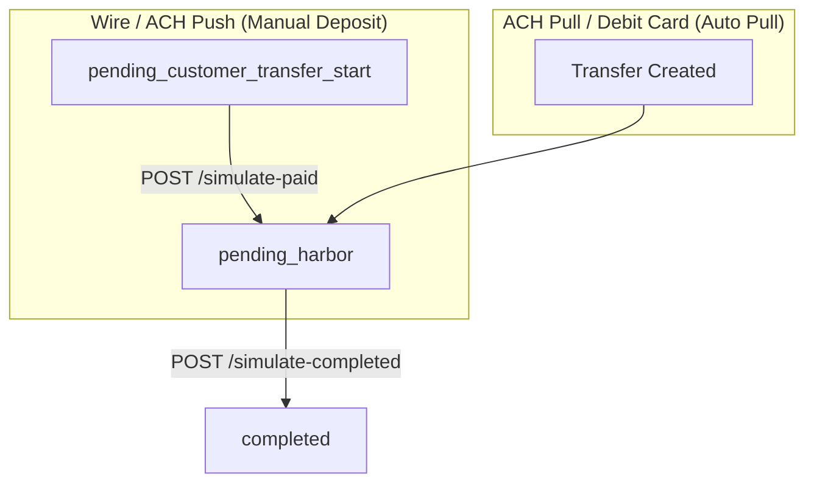
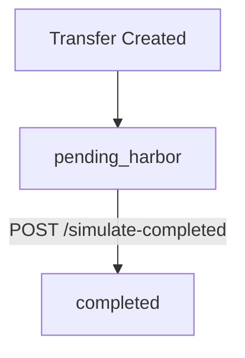

These endpoints are used to simulate internal status transitions for a given `Transfer` object. They are intended for testing and sandbox purposes only.

### Why Simulate?

In the Harbor Sandbox environment, certain external events (such as wire arrival or blockchain confirmation) do not happen automatically. To move a transfer through its lifecycle and test your integration, you must manually trigger these status transitions using the Simulation APIs.

### Sandbox Status Flows

#### On-Ramp Flow (Fiat → Crypto)



#### Off-Ramp Flow (Crypto → Fiat)



***

### Step 1: Simulate Customer Payment (Incoming)

**Endpoint**
`POST /api/v1/transfers/{transfer:uuid}/simulate-paid`

**Description**
Simulates the scenario where the customer has paid into the designated receiving account. This updates the transfer status from `pending_customer_transfer_start` to `pending_harbor`.

**Applicable Payment Methods:**

* Wire
* ACH Push

**Not Applicable For:**

* **ACH Pull & Debit Card (On-Ramp):** These methods automatically simulate pull funding in the Sandbox environment, bypassing this step.
* **Off-Ramp & Swap (On-Chain):** These methods require real testnet USDC transfers. Manual simulation is not supported.

<br />

<Callout icon="⚠️" theme="warning">
  If you attempt to call this API for ACH Pull or Debit Card, you will receive an error indicating that simulation is not applicable because it is automated. For Off-Ramp or Swap, you will receive an error directing you to use the Claim Testnet USDC API instead.
</Callout>

#### API Request: Simulate that the payment has been executed 

```curl
curl --location --request POST 'https://harbor-sandbox.owlpay.com/api/v1/transfers/{{TRANSFER_UUID}}/simulate-paid' \
--header 'Content-Type: application/json' \
--header 'Accept: application/json' \
--header 'X-API-KEY: {{API_KEY}}' \
--header 'Idempotency-Key: {{Idempotency-Key}}'
```

<br />

### Step 2: Simulate Harbor Settlement (Outgoing)

**Endpoint**
`POST /api/v1/transfers/{transfer:uuid}/simulate-completed`

**Description**
Simulates the scenario where Harbor has executed the payment to the final destination (bank or blockchain address). This updates the transfer status from `pending_harbor` to `completed`.

**Applicable For:**

* All transfer types once they reach the `pending_harbor` state.

```curl
curl --location --request POST 'https://harbor-sandbox.owlpay.com/api/v1/transfers/{{TRANSFER_UUID}}/simulate-completed' \
--header 'Content-Type: application/json' \
--header 'Accept: application/json' \
--header 'X-API-KEY: {{API_KEY}}' \
--header 'Idempotency-Key: {{Idempotency-Key}}'
```

***

### Troubleshooting

| Error Message | Cause | Resolution |
| :--- | :--- | :--- |
| `Transfer is not in pending_customer_transfer_start state.` | The transfer status is already `pending_harbor` or higher. | Skip Step 1 and proceed to Step 2 (`/simulate-completed`). |
| `Simulation is not applicable for ACH_PULL / DEBIT_CARD on-ramp transfers — funding is automated in sandbox mode, no simulation is needed.` | Attempted to simulate payment for an automated pull method (ACH Pull or Debit Card On-Ramp). | These payment methods automatically simulate pull funding in Sandbox. No manual simulation is required; wait for the status to transition to `pending_harbor`. |
| `Simulation is not allowed for this transfer. Please transfer real USDC on-chain to proceed. If you need testnet USDC, use the Claim Testnet USDC API: POST /api/v1/faucet/usdc.` | Attempted to simulate payment for an Off-Ramp or Swap (On-Chain) transfer. | Manual simulation is not allowed for On-Chain deposits. Please claim testnet USDC using the faucet API, then perform a real on-chain transaction. |
| `Order status is not unpaid` | The underlying Bank Module order is already paid or in process. | The payment has already been simulated or processed. Proceed to Step 2 (`/simulate-completed`). |
| `Transfer is not in pending_harbor state.` | Attempted to call `/simulate-completed` before the transfer reached `pending_harbor`. | Confirm the transfer status is exactly `pending_harbor`. For Wire/ACH Push, ensure `/simulate-paid` was called first. |
| `Order status is not paid` | The underlying Bank Module order has not been marked as paid yet. | Ensure that payment simulation (Step 1) is completed successfully first. |
| `Order status is not in_process` | The underlying Bank Module order is not in the correct processing state. | Ensure the order is not expired or already completed. |
| `This endpoint is not available in production environment` or `This endpoint is not available in production` | You are calling the simulation API using the Production environment endpoint. | Switch to the Sandbox environment (`harbor-sandbox.owlpay.com`). |
