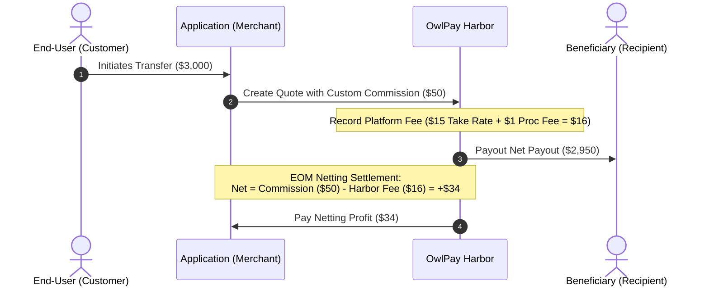

OwlPay Harbor operates on a **B2B Billing Model**. All service fees are billed directly to the **Application (Merchant)**, and no fees are ever charged directly to your end-users.

Instead of real-time balance deductions, we utilize a **Netting Settlement** approach, where all fees and commissions are consolidated and settled at the end of each billing cycle.

***

### 1. Fee Structure

The total cost of using the platform consists of two components billed by OwlPay to the **Application (Merchant)**:

* **Platform Take Rate (%)**: A percentage-based service fee charged by OwlPay Harbor on the Total Transaction Amount.
* **Processing Fee:** A fixed fee charged per successful transaction.

### 2. Three Core Principles of Harbor Pricing

To successfully integrate and manage your costs, keep these three fundamental principles in mind:

* **Use the Quoted Exchange Rate as Source of Truth:** The exchange rate (`exchange_rate`) and amounts returned by the `/v2/transfers/quotes` endpoint are authoritative for that specific transfer. Always calculate amounts for your end-users from the quote response itself, rather than assuming it will match an external reference rate.
* **Monthly Merchant-Level Billing:** Your Fee Set charges (Platform Take Rate % + Processing Fee) are billed directly to the **Application (Merchant)** at the end of each billing cycle (EOM), never directly to your end-users. Note that your contract billing rates are completely isolated from Harbor's underlying liquidity provider costs, ensuring predictable billing.
* **Commission as Cost Coverage (Netting Profitability):** The `commission` parameter is designed for the Application (Merchant) to charge end-users. By setting a custom commission that incorporates or exceeds Harbor's Fee Set charges, you can ensure that your end-of-month Net Settlement is positive, turning transaction processing into a net revenue stream.

### 3. The Logic of "Commission"

When you initiate a transfer on behalf of your end-user, the `commission` parameter determines the final payout amount to the beneficiary and your own revenue.

* **Full Payout (Default):** If `commission` is set to `0`, the beneficiary receives the **full amount** (minus any market FX conversion if applicable, and minus the network fee for on-chain transfers where it is billed to the customer).
  * _Example: A 1,000 USDC transfer results in a 1,000 USD payout._
* **Custom Commission:** If you set a `commission`, that amount is deducted from the transfer principal. This amount is recorded as your revenue and will be credited to you during the monthly netting settlement.

<Callout icon="📘" theme="info">
  **Important:**
  Regardless of whether you choose to charge a commission, OwlPay will charge the Application (Merchant) the agreed Service Fees (Platform Take Rate + Processing Fee) for every successful transaction.
</Callout>

***

### 4. Workflow: From Quote to Settlement

#### Step 1: Request a Quote

Define the transfer details and your desired markup via the `/v2/transfers/quotes` endpoint.

Two types of fees will appear on the quote: the harbor fee and the commission.
The harbor fee is the fee we will charge for your applications at the end of each month.
The commission is the fee we collect from the sender on your behalf and remit to you at the end of each month. You will receive the commission after the harbor fee has been deducted.

```curl
curl --location 'https://harbor-sandbox.owlpay.com/api/v2/transfers/quotes' \
--header 'Accept: application/json' \
--header 'Content-Type: application/json' \
--header 'X-API-KEY:{{YOUR_API_KEY}}' \
--data '{
    "source": {
        "country": "US",
        "chain": "ethereum",
        "asset": "USDC",
        "type": "individual"
    },
    "destination": {
        "country": "HK",
        "asset": "USD",
        "amount": 3000,
        "type": "individual"
    },
    "commission": {
        "amount": 10,
        "percentage": 0
    }
}'
```

<br />

#### Step 2: Initiate a Transfer

Once you have obtained a `quote_id`, use this endpoint to initiate the actual fund movement. At this stage, OwlPay records the transaction details—including the commission and the applicable service fees—for the end-of-month (EOM) netting process.

```bash
curl --location 'https://harbor-sandbox.owlpay.com/api/v2/transfers' \
--header 'Content-Type: application/json' \
--header 'Accept: application/json' \
--header 'X-API-KEY: YOUR_API_KEY' \
--data '{
    "on_behalf_of": "{{YOUR_CUSTOMER_UUID}}",
    "quote_id": "{{QUOTE_UUID}}",
    "application_transfer_uuid": "{{YOUR_APPLICATION_TRANSFER_UUID}}",
    "destination": {
        "beneficiary_info": {
            "beneficiary_dob": "1990-01-01",
            "beneficiary_id_doc_number": "12345678",
            "beneficiary_address": {
                "street": "xxx 1234th Ave S",
                "city": "Minneapolis",
                "state_province": "MN",
                "postal_code": "55416",
                "country": "US"
            },
            "beneficiary_name": "John Doe"
        },
        "payout_instrument": {
            "bank_name": "The Hongkong and Shanghai Banking Corporation Limited",
            "account_holder_name": "CHAN TAI MAN",
            "account_number": "123456789012",
            "swift_code": "HSBCHKHH"
        },
        "transfer_purpose": "SALARY",
        "is_self_transfer": true
    }
}'
```

<br />

### 5. Monthly Settlement & Netting Logic

OwlPay Harbor operates on a **post-payment settlement** basis. The Application (Merchant) is not required to maintain a real-time account balance. Instead, OwlPay reconciles all transactions at the end of each billing cycle using a **Netting Calculation**.



#### The Settlement Formula

The final netting amount moved between OwlPay and the Application (Merchant) is calculated as:

**Formula:** `Net Settlement Amount` = `Total Commissions Earned` - `Total Harbor Fees`

***

#### Scenario A: Application Net Cost (Low Commission)

_In this case, the Application (Merchant) sets a low commission, choosing to absorb part of the service costs._

**Assumptions:**

* **Transaction:** $3,000
* **Application Commission:** **$10**
* **Harbor Fee:** 0.5% Take Rate ($15) + $1 Processing Fee = **$16**

| Item                       | Calculation   | Amount     | Impact on Application (Merchant)          |
| :------------------------- | :------------ | :--------- | :---------------------------------------- |
| **Total Amount**           | From End-User | $3,000     | Original Principal                        |
| **Beneficiary Receives**   | $3,000 - $10  | **$2,990** | Net Payout                                |
| **Application Commission** | Set in Quote  | **+$10**   | **Your Revenue**                          |
| **Harbor Fee**             | $15 + $1      | **-$16**   | **Your Cost**                             |
| **Net Settlement (EOM)**   | $10 - $16     | **-$6**    | **Application (Merchant) pays OwlPay $6** |

***

#### Scenario B: Application Net Profit (High Commission)

_In this case, the Application (Merchant) sets a higher commission to cover costs and generate net revenue._

**Assumptions:**

* **Transaction:** $3,000
* **Application Commission:** **$50**
* **Harbor Fee:** 0.5% Take Rate ($15) + $1 Processing Fee = **$16**

| Item                       | Calculation   | Amount     | Impact on Application (Merchant)           |
| :------------------------- | :------------ | :--------- | :----------------------------------------- |
| **Total Amount**           | From End-User | $3,000     | Original Principal                         |
| **Beneficiary Receives**   | $3,000 - $50  | **$2,950** | Net Payout                                 |
| **Application Commission** | Set in Quote  | **+$50**   | **Your Revenue**                           |
| **Harbor Fee**             | $15 + $1      | **-$16**   | **Your Cost**                              |
| **Net Settlement (EOM)**   | $50 - $16     | **+$34**   | **OwlPay pays Application (Merchant) $34** |

<br />

***

### 6. Reconciliation & Reporting

All fees and commissions are permanently linked to your unique `application_transfer_uuid`. This ensures that your finance and accounting teams can track, audit, and reconcile every transaction, commission payout, and Harbor service fee using our comprehensive dashboard and reporting tools.

<br />

Please don’t hesitate to contact us at [contact-us@owlting.com](mailto:contact-us@owlting.com).

<br />
