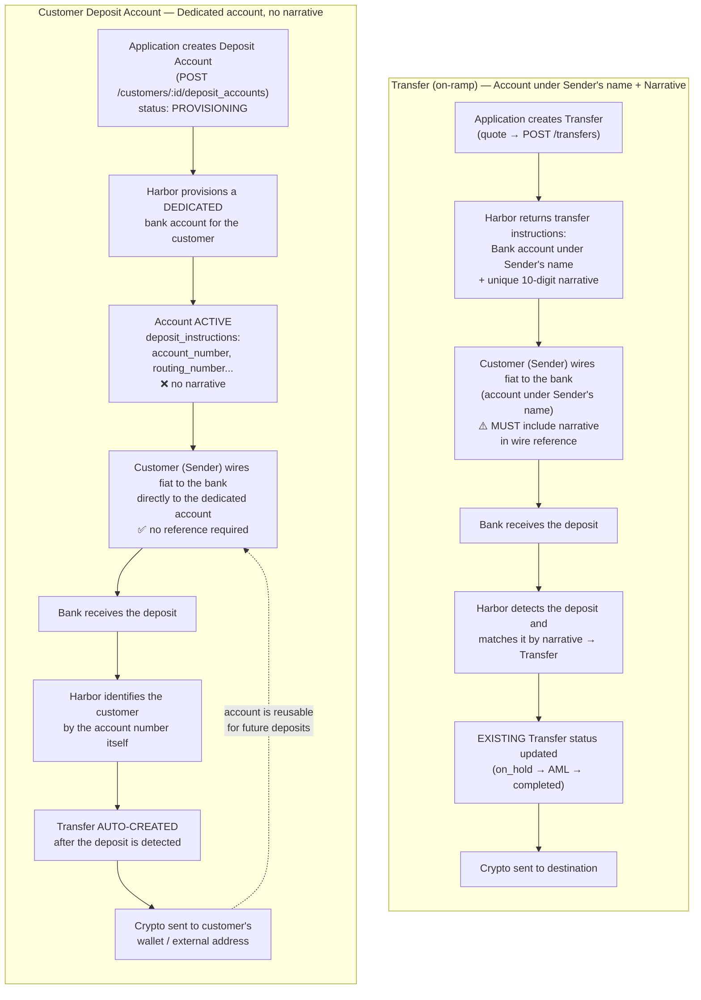
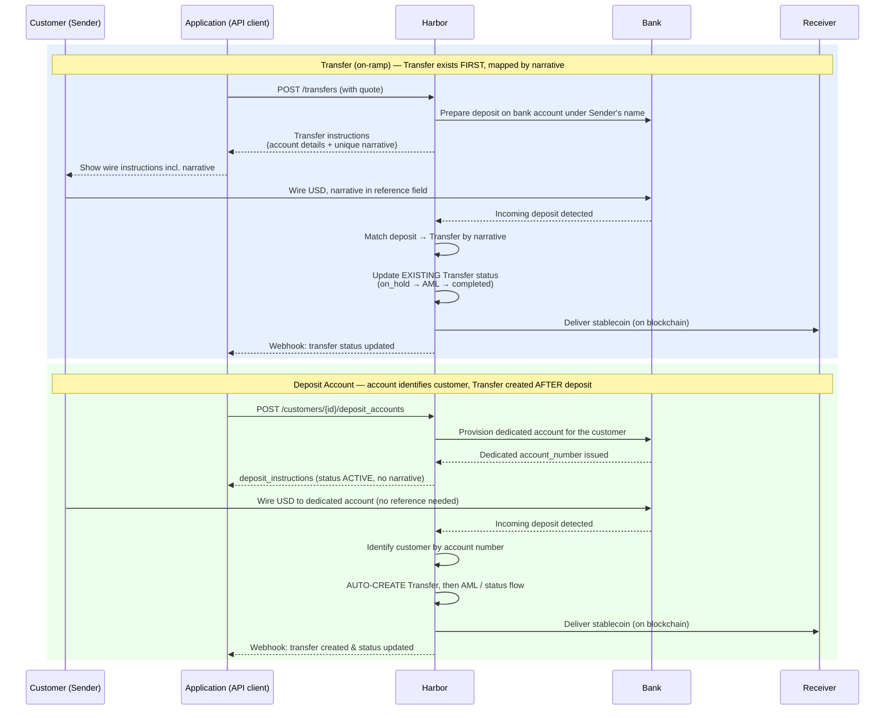

> 📘 Regional Availability & Usage
>
> The detailed instructions and workflows outlined in this guide are primarily optimized for **US users (including both businesses and individuals)**. 
> 
> **Non-US users can still perform on-ramps and obtain bank accounts** through Harbor, but the underlying mechanisms, requirements, and usage guidelines may differ. Please consult your OwlPay representative for tailored non-US onboarding instructions.

When integrating fiat-to-crypto (on-ramp) services with Harbor, you can utilize bank accounts in two distinct ways depending on your business model: **Transfer (On-Ramp)** or **Customer Deposit Account**. 

Understanding the differences in account provisioning, fund routing, and transaction mapping is critical for a smooth integration.

---

### 💡 Key Concept Overview

* **Transfer (On-Ramp)**: Uses a **bank account under the Sender's name** with a unique **Narrative** (a 10-digit code). The Customer (Sender) receives wire instructions containing this account details and the narrative. The Customer (Sender) **must** input this narrative into the wire reference field during the bank transfer. Harbor uses this narrative to map the deposit to the pre-created Transfer object.
* **Customer Deposit Account**: Harbor provisions a **dedicated/virtual bank account** for each customer. The customer gets their own unique account details. **No narrative is required** when transferring funds. Harbor identifies the customer directly by the account number, automatically creates a Transfer after the deposit is detected, and routes the funds.

---

### 1. Architectural Flowchart

---

### 2. Sequence Diagrams

---

### 3. Core Differences

* **Account Type & Ownership**:
  * **Transfer (On-Ramp)**: Bank account under the Sender's name (requires a unique Narrative to map the specific transfer).
  * **Customer Deposit Account**: Dedicated Virtual Account registered for the specific Customer (no narrative needed).

* **Narrative (Wire Reference)**:
  * **Transfer (On-Ramp)**: **Required**. A unique 10-digit number. This is the sole identifier for mapping the deposit.
  * **Customer Deposit Account**: **Not Required**. The unique account number itself identifies the customer.

* **Transfer Creation Timing**:
  * **Transfer (On-Ramp)**: **Before deposit**. Created proactively by the Application client via API.
  * **Customer Deposit Account**: **After deposit**. Automatically created by Harbor once the bank detects incoming funds.

* **Reusability**:
  * **Transfer (On-Ramp)**: **No**. A narrative is one-time use per specific Transfer request.
  * **Customer Deposit Account**: **Yes**. The account is permanently assigned to the customer and can be reused for any future deposits.

* **Mapping Risk**:
  * **Transfer (On-Ramp)**: **Medium/High**. Payers may forget or mistype the narrative, leading to pending deposits that require manual mapping.
  * **Customer Deposit Account**: **Low/None**. There is no reference field to mistype.
