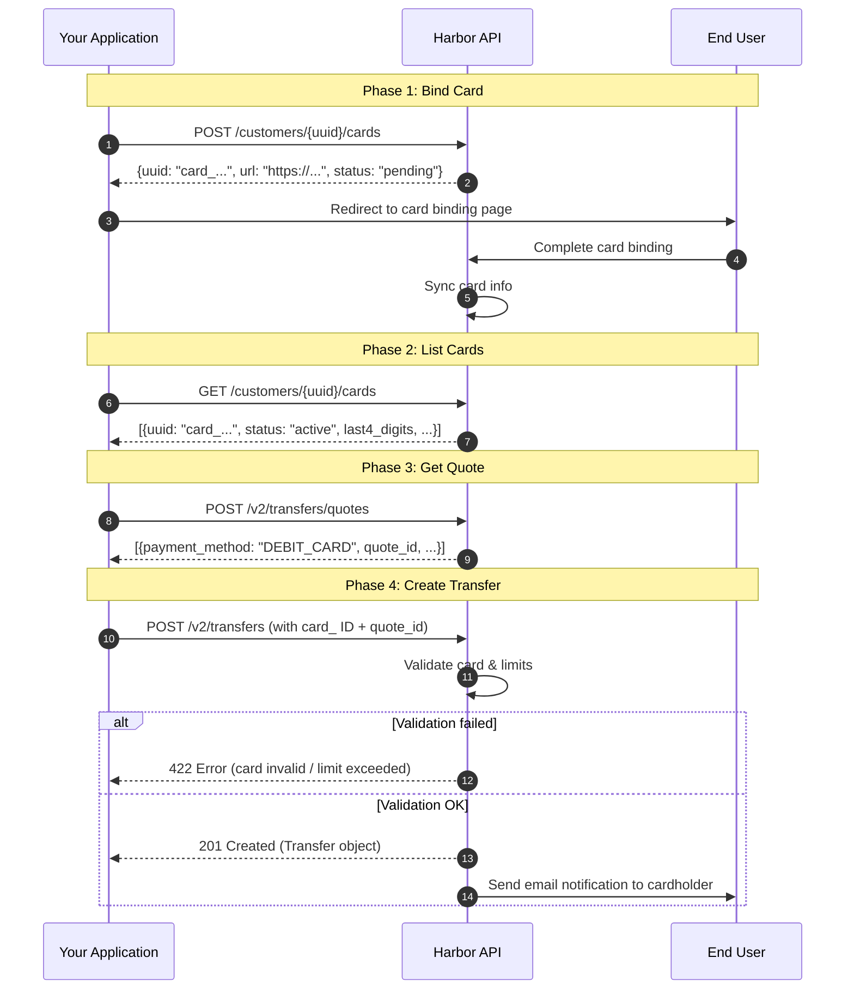

<Callout icon="⚠️" theme="warning">
  The Debit Card feature is currently available only for **Individual** customers. Business customers are not yet supported.
</Callout>

<Callout icon="📧" theme="info">
  Before executing an Debit Card Pull transaction, OwlPay will send an authorization email to the Customer requesting their approval. The email will clearly identify which Application is initiating the pull request.
</Callout>

***

### Complete Flow Diagram



***

### Prerequisites

1. Your Application has the `DEBIT_CARD` payment method enabled
2. The Customer has completed KYC verification (status: `VERIFIED`)
3. The Customer has completed bank compliance onboarding (CRB Bank Onboarding status: `ONBOARDED`)

<Callout icon="📋" theme="info">
  **Support Coverage Notice:** Before integrating, please review the eligible card types, network brands, and countries in the [**Debit Card Support Coverage**](/docs/debit-card-coverage) guide. Note that credit cards are not supported.
</Callout>

### Flow Overview

```
1. Bind Card       → User completes card binding via the binding page
2. List Cards      → Retrieve the list of linked cards
3. Get Quote       → Get a DEBIT_CARD quote
4. Create Transfer → Submit a transfer with the card ID
5. Email Notification → OwlPay sends a notification email to the cardholder
```

> **Important:** When a Debit Card transfer is created, OwlPay will send a notification email to the cardholder informing them of the upcoming charge. Please ensure the user is aware of this process.

***

### Step 1: Bind Card

Generate a card binding URL for the customer and redirect them to complete card authorization and binding.

#### Request

```bash
curl --location --request POST 'https://harbor-sandbox.owlpay.com/api/v1/customers/{{CUSTOMER_UUID}}/cards' \
--header 'Content-Type: application/json' \
--header 'Accept: application/json' \
--header 'X-API-KEY: {{API_KEY}}' \
--data-raw '{
    "redirect_url": {
        "success": "https://yourapp.com/card/success",
        "failed": "https://yourapp.com/card/failed"
    }
}'
```

| Parameter              | Type   | Required | Description                                                                 |
| ---------------------- | ------ | -------- | --------------------------------------------------------------------------- |
| `redirect_url.success` | string | No       | Redirect URL after successful binding. Supports web links or app deep links |
| `redirect_url.failed`  | string | No       | Redirect URL on binding failure. Supports web links or app deep links       |

#### Response (201)

```json
{
    "data": {
        "uuid": "card_abc123",
        "object": "customer_card",
        "customer_uuid": "cus_1234567890",
        "status": "pending",
        "last4_digits": null,
        "card_company": null,
        "pull_enabled": false,
        "push_enabled": false,
        "first_name": null,
        "last_name": null,
        "country_code": null,
        "issuer_country_code": null,
        "enabled": false,
        "restricted": false,
        "url": "https://card-binding.example.com/bind/card_abc123",
        "created_at": "2026-03-21T10:00:00+00:00",
        "updated_at": "2026-03-21T10:00:00+00:00"
    }
}
```

<Callout icon="📘" theme="info">
  **Card Information for Testing**

  For testing purposes, you may use the card number 4242424242424242. Ensure the expiration date is set to 12/31, the CVV to 123, and use 12345 as the postal/zip code to bypass validation during the integration process.
</Callout>

#### More Cards for Testing:

| Mastercard (Debit) | VISA OCT (Prepaid) | VISA OCT (Debit) |
| :----------------- | :----------------- | :--------------- |
| 5102589999999905   | 4000289999999908   | 4007589999999904 |
| 5102589999999913   | 4000289999999916   | 4007589999999912 |
| 5102589999999921   | 4000289999999924   | 4007589999999920 |
| 5102589999999939   | 4000289999999932   | 4007589999999938 |
| 5102589999999947   | 4000289999999940   | 4007589999999946 |
| 5102589999999954   | 4000289999999957   | 4007589999999953 |
| 5102589999999962   | 4000289999999965   | 4007589999999961 |
| 5102589999999970   | 4000289999999973   | 4007589999999979 |
| 5102589999999988   | 4000289999999981   | 4007589999999987 |
| 5102589999999996   | 4000289999999999   | 4007589999999995 |

<Image align="center" width="350px" src="https://files.readme.io/6d44b73f4f9158429b72bd1bba90d973cfab07a734b4b0273e4d5b6a8ae1b598-CleanShot_2026-05-07_at_05.46.012x.png" />

<br />

#### Integration

Present the returned `url` to the user via redirect or iframe. After the user completes card information entry on the binding page, the card status will change from `pending` to `active`, with `enabled` set to `true`, making it ready for transactions.

> **Note:** When `status` is `pending`, the returned `url` is the card binding page link. Once the card is activated, `url` becomes `null`.

***

### Step 2: List Cards

After the user completes card binding, call this API to retrieve the list of linked cards. The system automatically syncs the latest card status from upstream.

#### Request

```bash
curl --location --request GET 'https://harbor-sandbox.owlpay.com/api/v1/customers/{{CUSTOMER_UUID}}/cards' \
--header 'Accept: application/json' \
--header 'X-API-KEY: {{API_KEY}}'
```

#### Response (200)

```json
{
    "data": [
        {
            "uuid": "card_abc123",
            "object": "customer_card",
            "customer_uuid": "cus_1234567890",
            "status": "active",
            "last4_digits": "4242",
            "card_company": "Visa",
            "pull_enabled": true,
            "push_enabled": false,
            "first_name": "JOHN",
            "last_name": "DOE",
            "country_code": "US",
            "issuer_country_code": "US",
            "enabled": true,
            "restricted": false,
            "url": null,
            "created_at": "2026-03-21T10:00:00+00:00",
            "updated_at": "2026-03-21T10:05:00+00:00"
        }
    ]
}
```

| Field          | Description                                                                                               |
| -------------- | --------------------------------------------------------------------------------------------------------- |
| `uuid`         | Unique card identifier, prefixed with `card_`. **This ID is required in Step 4 when creating a transfer** |
| `status`       | Card status: `pending`, `active`, `expired`, `disabled`, `restricted`                                     |
| `last4_digits` | Last 4 digits of the card number                                                                          |
| `card_company` | Card network (e.g., `Visa`, `Mastercard`)                                                                 |
| `pull_enabled` | Whether the card supports pull (debit) transactions                                                       |
| `enabled`      | Whether the card is enabled for transactions. Only cards with `true` can be used                          |
| `restricted`   | Whether the card is restricted. If `true`, the card cannot be used                                        |

> Only cards with `status: active`, `enabled: true`, and `restricted: false` can be used to initiate transactions.

***

### Step 3: Get Debit Card Quote

Before initiating a transfer, get a quote to confirm the exchange rate, fees, and settlement amount.

#### Request

```bash
curl --location --request POST 'https://harbor-sandbox.owlpay.com/api/v2/transfers/quotes' \
--header 'Content-Type: application/json' \
--header 'Accept: application/json' \
--header 'X-API-KEY: {{API_KEY}}' \
--data-raw '{
    "on_behalf_of": "{{CUSTOMER_UUID}}",
    "source": {
        "amount": "100.00",
        "asset": "USD",
        "type": "individual",
        "country": "US"
    },
    "destination": {
        "asset": "USDC",
        "type": "individual",
        "chain": "stellar"
    }
}'
```

#### Response (200)

The response includes quotes for multiple payment methods. Select the item where `payment_method` is `DEBIT_CARD`.

```json
[
    {
        "id": "quote_f03AirZ3ZY...KBtFQfZtPDYv",
        "payment_method": "DEBIT_CARD",
        "source_amount": "100.00",
        "source_currency": "USD",
        "destination_amount": "99.50",
        "destination_currency": "USDC",
        "fee": "0.50",
        "quote_expire_date": "2026-03-21T09:30:00Z",
        "customer_limits": {
            "per_transaction_limit": "500.00",
            "daily_limit": "5000.00",
            "weekly_limit": "20000.00",
            "monthly_limit": "100000.00",
            "daily_spent": "0.00",
            "daily_remaining": "5000.00",
            "weekly_spent": "0.00",
            "weekly_remaining": "20000.00",
            "monthly_spent": "0.00",
            "monthly_remaining": "100000.00",
            "current_remaining": "500.00"
        }
    }
]
```

> Save the `id` (i.e., `quote_id`) from the `DEBIT_CARD` quote — it is required in the next step to create the transfer. When `on_behalf_of` is provided, the response includes `customer_limits` which can be used to display the user's transaction limits on the frontend.

***

### Step 4: Create Debit Card Transfer

Use the `card_` ID from Step 2 and the `quote_id` from Step 3 to create the transfer.

<Callout icon="⏳" theme="info">
  **Settlement Time Notice:** Debit Card transfers typically settle in **T+1** business days. For more details on fund availability and payment locks, see [**Settlement and Payment Lock Time**](/docs/payment-lock-time).
</Callout>

#### Request

```bash
curl --location --request POST 'https://harbor-sandbox.owlpay.com/api/v2/transfers' \
--header 'Content-Type: application/json' \
--header 'Accept: application/json' \
--header 'X-API-KEY: {{API_KEY}}' \
--header 'Idempotency-Key: {{Idempotency-Key}}' \
--data-raw '{
    "on_behalf_of": "{{CUSTOMER_UUID}}",
    "quote_id": "{{QUOTE_ID}}",
    "application_transfer_uuid": "{{YOUR_ORDER_ID}}",
    "source": {
        "payment_instrument": {
            "linked_card_id": "card_abc123"
        }
    },
    "destination": {
        "beneficiary_info": {
            "...": "Fill according to quote requirements"
        },
        "payout_instrument": {
            "address": "0x1234567890abcdef1234567890abcdef12345678"
        },
        "transfer_purpose": "SALARY",
        "is_self_transfer": true
    }
}'
```

| Parameter                                  | Type   | Required | Description                                                         |
| ------------------------------------------ | ------ | -------- | ------------------------------------------------------------------- |
| `on_behalf_of`                             | string | Yes      | Customer UUID                                                       |
| `quote_id`                                 | string | Yes      | Quote ID obtained in Step 3                                         |
| `application_transfer_uuid`                | string | Yes      | Your order ID (used for idempotency)                                |
| `source.payment_instrument.linked_card_id` | string | Yes      | **Card ID from Step 2 (prefixed with `card_`)**                     |
| `destination`                              | object | Yes      | Destination information (payout address, beneficiary details, etc.) |

#### Response (201 Created)

On success, returns the full Transfer object with an initial status of `PENDING_CUSTOMER_TRANSFER_START`.

#### Error Scenarios

| HTTP Status | Reason                                                                  |
| ----------- | ----------------------------------------------------------------------- |
| `422`       | Card does not exist or does not belong to this Application              |
| `422`       | Card status is not `active`                                             |
| `422`       | Card is not enabled (`enabled` is `false`)                              |
| `422`       | Card is restricted (`restricted` is `true`)                             |
| `422`       | Card has been blocklisted                                               |
| `422`       | Transaction limit exceeded (per-transaction / daily / weekly / monthly) |
| `404`       | Customer not found or does not belong to this Application               |

***

### Email Notification

When a Debit Card transfer is successfully created, **OwlPay will automatically send a notification email to the cardholder** containing:

* Charge amount and currency
* Transaction details

This email ensures the cardholder is aware of the upcoming charge, in compliance with regulatory requirements. No additional action is needed from the Application side for this notification.

***

### Complete Flow Diagram

<Image align="center" src="https://files.readme.io/73b77f978db62a936a98658e5f938fc64bc1542d6e371da0722b01f1df36bf35-Card_Uuid_Flow-2026-03-21-012320.png" />

***

### Transfer Status Flow

| Status                            | Description                                                 |
| --------------------------------- | ----------------------------------------------------------- |
| `PENDING_CUSTOMER_TRANSFER_START` | Transfer created, awaiting processing                       |
| `PENDING_HARBOR`                  | Being processed                                             |
| `COMPLETED`                       | Transfer complete, funds settled                            |
| `REJECT`                          | Transfer rejected                                           |
| `ON_HOLD`                         | Transfer temporarily frozen (may require additional review) |

> We recommend listening for transfer status changes via Webhooks to keep your system updated in real time.

<br />
