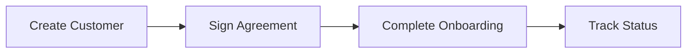

This page is a working reference for writing docs in this repo. Each section shows the component rendered, followed by the source to copy.

This page is **hidden**, so readers won't see it in the sidebar. To show it, set `hidden: false` in the frontmatter.

### Callouts

Use a callout to draw attention to a note, tip, or warning. The first heading inside a callout becomes its title.

<br />

<Callout icon="📘" theme="info">
  ### Info

  General information or a helpful note.
</Callout>

<br />

<Callout icon="👍" theme="okay">
  ### Success

  A tip, a recommended approach, or a confirmation.
</Callout>

<br />

<Callout icon="🚧" theme="warn">
  ### Warning

  Something the reader should be careful about.
</Callout>

<br />

<Callout icon="❗️" theme="error">
  ### Error

  Something that will break if done wrong.
</Callout>

<br />

<Callout icon="💡" theme="default">
  ### Default

  A neutral callout.
</Callout>

```mdx
<Callout icon="📘" theme="info">
  ### Info

  General information or a helpful note.
</Callout>
```

Available themes: `info`, `okay`, `warn`, `error`, and `default`. Any emoji works as the `icon`.

#### Blockquote callouts

You can also write a callout as a blockquote that starts with an emoji. The emoji sets the theme: 📘 info, 👍 success, 🚧 warning, ❗️ error.

<br />

> 📘 Blockquote callout
>
> The first line is the title; the rest is the body.

```md
> 📘 Blockquote callout
>
> The first line is the title; the rest is the body.
```

### Cards

Use cards for a grid of links, such as an overview page pointing to its child pages.

<Cards columns={2}>
  <Card title="Quickstart" href="/docs/quickstart" icon="fa-solid fa-rocket">
    Create your first customer and transfer.
  </Card>

  <Card title="API Keys" href="/docs/api-keys" icon="fa-solid fa-key">
    Authenticate requests with your API key.
  </Card>
</Cards>

```mdx
<Cards columns={2}>
  <Card title="Quickstart" href="/docs/quickstart" icon="fa-solid fa-rocket">
    Create your first customer and transfer.
  </Card>

  <Card title="API Keys" href="/docs/api-keys" icon="fa-solid fa-key">
    Authenticate requests with your API key.
  </Card>
</Cards>
```

* `columns` sets how many cards appear per row.
* `icon` takes a [Font Awesome](https://fontawesome.com/icons) class, such as `fa-solid fa-key`.
* Use `/docs/<page>` links in `href`.

### Tabs

Use tabs to show alternatives side by side, such as setup steps for different tools.

<Tabs>
  <Tab title="Sandbox">
    Use `https://harbor-sandbox.owlpay.com` while you build and test.
  </Tab>

  <Tab title="Production">
    Use `https://harbor.owlpay.com` once your integration is approved.
  </Tab>
</Tabs>

```mdx
<Tabs>
  <Tab title="Sandbox">
    Use `https://harbor-sandbox.owlpay.com` while you build and test.
  </Tab>

  <Tab title="Production">
    Use `https://harbor.owlpay.com` once your integration is approved.
  </Tab>
</Tabs>
```

### Accordion

Use an accordion to tuck away details that not every reader needs.

<br />

<Accordion title="What is an idempotency key?" icon="fa-solid fa-circle-question">
  A unique value you send in the `X-Idempotency-Key` header so a retried request isn't processed twice.
</Accordion>

```mdx
<Accordion title="What is an idempotency key?" icon="fa-solid fa-circle-question">
  A unique value you send in the `X-Idempotency-Key` header so a retried request isn't processed twice.
</Accordion>
```

### Columns

Use columns to place content side by side.

<Columns layout="auto">
  <Column>
    **Left column**

    Content for the first column.
  </Column>

  <Column>
    **Right column**

    Content for the second column.
  </Column>
</Columns>

```mdx
<Columns layout="auto">
  <Column>
    **Left column**

    Content for the first column.
  </Column>

  <Column>
    **Right column**

    Content for the second column.
  </Column>
</Columns>
```

### Images

<Image align="center" border={true} width="200px" caption="Customer KYC status change diagram" src="https://files.readme.io/6d124f9016e0d0131981a451bccb9a67c7b1a8a816ca1a3965442d29be1a2fa2-Customer_Status.jpg" />

```mdx
<Image align="center" border={true} width="200px" caption="Customer KYC status change diagram" src="https://files.readme.io/…-Customer_Status.jpg" />
```

* `align`: `left`, `center`, or `right`.
* `border`: `{true}` to draw a border.
* `width`: any CSS width, such as `200px` or `50%`.
* `caption`: text shown under the image.

### Glossary

Wrap a term defined in the project glossary to show its definition on hover.

The <Glossary>Harbor</Glossary> API uses API keys for authentication.

```mdx
The <Glossary>Harbor</Glossary> API uses API keys for authentication.
```

The term must already exist in your ReadMe project's glossary.

### Anchor

Use `Anchor` when a link needs extra attributes, such as opening in a new tab.

<Anchor label="Harbor Portal" target="_blank" href="https://harbor-sandbox.owlpay.com/portal">Open the Harbor Portal</Anchor>

```mdx
<Anchor label="Harbor Portal" target="_blank" href="https://harbor-sandbox.owlpay.com/portal">Open the Harbor Portal</Anchor>
```

### Links

| Link to | Syntax | Notes |
| :--- | :--- | :--- |
| A guide page | `[Quickstart](doc:quickstart)` | Checked by `npx @readme/cli lint`. Doesn't click through in the local preview. |
| A guide page | `[Quickstart](/docs/quickstart)` | Works in the local preview. Not checked by the linter. |
| An API reference page | `[Create a transfer](/reference/createatransferv2)` | Uses the reference page's file name. |
| A section on a page | `[Example](/docs/api-keys#example)` | Anchors are the heading text in lowercase, with spaces as hyphens. |

### Code blocks

Add a language for syntax highlighting, and an optional title after it.

```json Response (201 Created)
{
  "data": {
    "uuid": "{{customer_uuid}}",
    "object": "customer"
  }
}
```

````md
```json Response (201 Created)
{
  "data": {
    "uuid": "{{customer_uuid}}",
    "object": "customer"
  }
}
```
````

#### Code tabs

Consecutive code blocks with no text between them are combined into one block with tabs. The title of each block becomes its tab name.

```curl cURL
curl --request GET 'https://harbor-sandbox.owlpay.com/api/v1/customers' \
--header 'X-API-KEY: {{API_KEY}}'
```
```javascript Node.js
const res = await fetch('https://harbor-sandbox.owlpay.com/api/v1/customers', {
  headers: { 'X-API-KEY': process.env.API_KEY },
});
```

````md
```curl cURL
curl --request GET 'https://harbor-sandbox.owlpay.com/api/v1/customers' \
--header 'X-API-KEY: {{API_KEY}}'
```
```javascript Node.js
const res = await fetch('https://harbor-sandbox.owlpay.com/api/v1/customers', {
  headers: { 'X-API-KEY': process.env.API_KEY },
});
```
````

### Mermaid diagrams

Use a `mermaid` code block to draw a diagram.



````md

````

### Tables

| Status | Meaning |
| :--- | :--- |
| `verifying` | The customer is under review. |
| `verified` | The customer has been approved. |

```md
| Status | Meaning |
| :--- | :--- |
| `verifying` | The customer is under review. |
| `verified` | The customer has been approved. |
```

Use `:---`, `:---:`, or `---:` to align a column left, center, or right.

### Frontmatter

Every page starts with a frontmatter block.

```yaml
---
title: Quickstart
excerpt: A one-line summary shown under the title.
hidden: false
---
```

* `title`: the page title shown in the sidebar and at the top of the page.
* `excerpt`: the summary shown under the title.
* `hidden`: `true` hides the page from the sidebar.

The page's URL comes from its file name, or the folder name for an `index.md`. A `slug` field in the frontmatter is ignored.

### More components

ReadMe's component marketplace has more components, such as **Steps**, **Terminal**, **Banner**, **Spoiler**, and **ToggleList**. They aren't available by default. To list them, run:

```sh
npx @readme/cli components list
```

To add one to the repo, run `npx @readme/cli components add <Name>`. This copies it into `./components/`.
